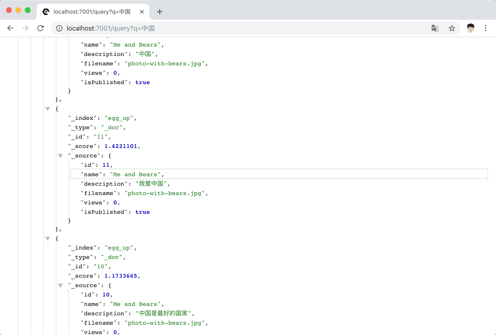

# Egg up

Egg 快速开发框架


### 快速创建 controller

```
npx plop controller
```

输入你控制器的名字，小写就行，更多 Model、Service 模板，可以自定义，参考 plop 文档。


### 自动验证

会找到 `home.yml` 里面的规则，并验证。

```ts
const r = ProxyRouter(router)
r.get('home', '/', controller.home.index);
```

### 依赖注入

```ts
import { Service } from 'egg';
import { context } from 'egg-aop';

/**
 * Test Service
 */
@context()
export default class Test extends Service {
  /**
   * sayHi to you
   * @param name - your name
   */
  public async sayHi(name: string) {
    return `hi, ${name}`;
  }
}
```

```ts
import TestService from '@service/test';
import { lazyInject } from 'egg-aop';

export default class HomeController extends Controller {
  @lazyInject()
  private testService: TestService;
}
```

### 路径重写

```ts
import Photo from '@model/photo';
```

需要配置 `package.json`

```json
  "_moduleAliases": {
    "@model": "app/model",
    "@framework": "app/framework",
    "@middleware": "app/middleware",
    "@service": "app/service"
  },
```

和 `tsconfig.json`

```json
"paths": {
    "@model/*": ["app/model/*"],
    "@framework/*": ["app/framework/*"],
    "@*":["app/*"]
}
```

## 添加视频推流示例

`controller/video/push`

## 添加全文检索引擎，自行安装 elasticearch 配置中文分词 ik。

`controller/home/query`

在计划任务里面同步数据到 `elasticsearch`


